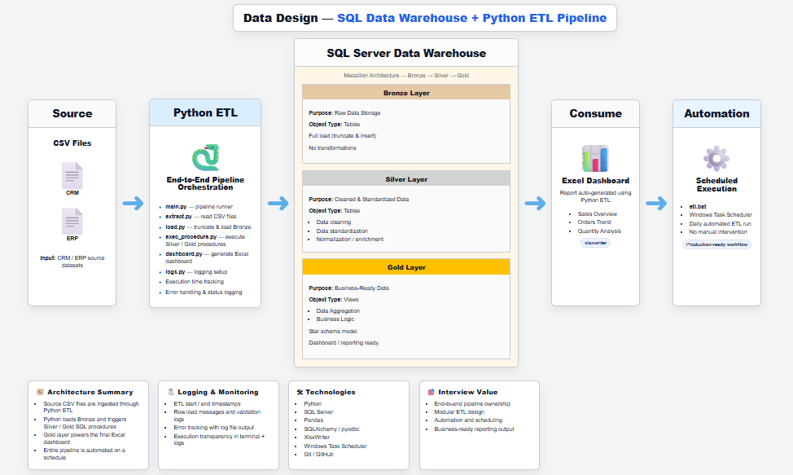
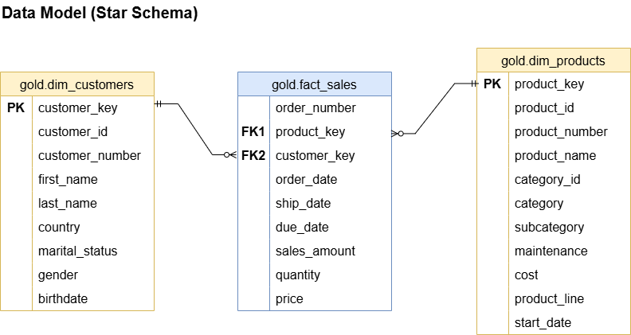

# 🏗️ End-to-End Data Warehouse Project

An end-to-end **Data Warehouse solution** built using **Python and SQL Server**, implementing the **Medallion Architecture (Bronze → Silver → Gold)** with full ETL automation.

---

## 🚀 Project Overview

This project demonstrates how to build a complete **Data Engineering pipeline**:

- Extract data from CSV files (CRM & ERP)
- Load raw data into SQL Server (Bronze Layer)
- Clean and transform data (Silver Layer)
- Create business-ready views (Gold Layer)
- Generate Excel dashboards automatically
- Automate the pipeline using Batch file & Task Scheduler

---

## 🏗️ Architecture



## 🔄 Data Flow (High Level)

```text
Source (CSV Files)
       ↓
Python ETL
       ↓
SQL Server Data Warehouse
  ├── Bronze
  ├── Silver
  └── Gold
       ↓
Excel Dashboard
       ↓
Automation (Batch + Scheduler)
```

---

## 🧩 Data Model (Star Schema)



---

## 🛠️ Tech Stack

- Python (pandas, SQLAlchemy, pyodbc)
- SQL Server
- Excel (Dashboard)
- Windows Task Scheduler

---

## ▶️ How to Run

```bash
pip install -r requirements.txt
python python_etl/main.py
